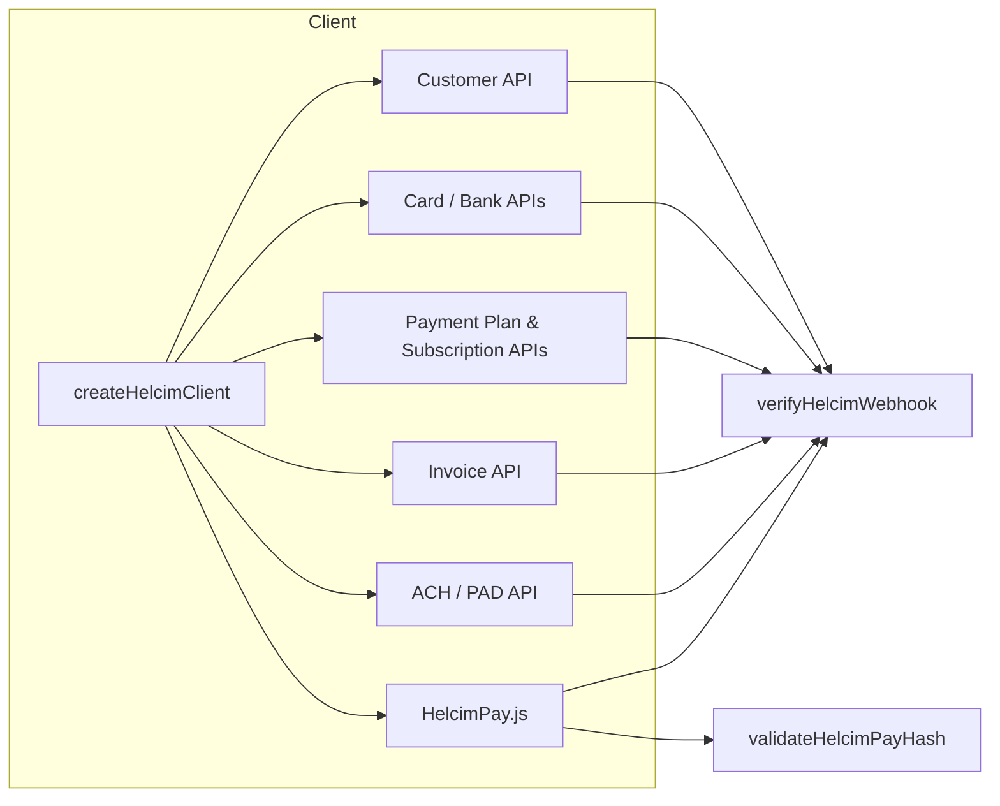

# `helcim-client`

A type-safe, product-neutral Helcim API client for Node.js.

The client wraps the **Helcim Payment API**, **Recurring API** (payment plans & subscriptions), the **Customer/Card vault**, **HelcimPay.js** checkout session initialization, and the two critical verification primitives that every Helcim integration needs: **webhook HMAC-SHA256 verification** and **HelcimPay response-hash validation**.

---

## Why Helcim

Helcim is a Calgary-based payment processor offering interchange-plus pricing with automatic volume-tiered margins, first-class Canadian rails (Interac Debit, ACH/EFT-PAD), and a Canadian-operated stack. See [Helcim pricing](https://www.helcim.com/pricing/) for current rates, and [`docs/PRICING.md`](./docs/PRICING.md) for a dated cost comparison against alternatives.

---

## What this library covers



* **Customer vault** — create, list, and update customers and their card/bank-account tokens.
* **Cards & bank accounts** — store, verify, and set default payment methods, with built-in support for Canadian transit/institution and U.S. routing/account number fields.
* **Payment plans & subscriptions** — schedule recurring charges and manage subscription lifecycle.
* **Transactions & refunds** — card transactions and refunds with idempotency-key support.
* **ACH / PAD** — withdraw funds and manage pre-authorized debit agreements.
* **Invoices** — create, list, retrieve, and pay invoices.
* **HelcimPay.js** — initialize a checkout session and validate the response hash so you can trust the returned `cardTransactionId`.
* **Webhook verification** — constant-time HMAC-SHA256 validation of `webhook-signature` headers, including multi-signature parsing.
* **Defensive decoders** — normalize Helcim's inconsistent casing/aliasing (`camelCase`, `PascalCase`, `snake_case`, and provider-specific variants) into a single predictable TypeScript model.

---

## Installation

```bash
npm install @clocklobster/helcim-client
# or
pnpm add @clocklobster/helcim-client
```

---

## Quick start

```typescript
import { createHelcimClient, createHelcimConfigFromEnv } from '@clocklobster/helcim-client';

// Configuration is read from the consuming application's environment.
// Required: HELCIM_API_TOKEN. Optional: HELCIM_ENV / HELCIM_BASE_URL / HELCIM_WEBHOOK_VERIFIER_TOKEN.
const config = createHelcimConfigFromEnv();
if (!config) throw new Error('Helcim is not configured — set HELCIM_API_TOKEN');

const helcim = createHelcimClient(config, fetch);

// Create a customer
const customer = await helcim.createCustomer({
  customerCode: 'example-001',
  contactName: 'Example Customer',
  billingAddress: {
    name: 'Example Customer',
    street1: '123 Example St',
    city: 'Example City',
    province: 'AB',
    country: 'CA',
    postalCode: 'A1A 1A1',
  },
});
```

### Verify a webhook

```typescript
import { verifyHelcimWebhook } from '@clocklobster/helcim-client';

const ok = verifyHelcimWebhook(
  webhookId,         // from `webhook-id` header
  webhookTimestamp,  // from `webhook-timestamp` header
  rawBody,           // the raw request body, before JSON.parse
  signatureHeader,   // from `webhook-signature` header
  verifierToken,     // base64 secret from Helcim dashboard
);

if (!ok) return new Response('unauthorized', { status: 401 });
```

### Validate a HelcimPay response

```typescript
import { validateHelcimPayHash } from '@clocklobster/helcim-client';

const valid = validateHelcimPayHash(
  responseData,  // the parsed JSON object HelcimPay posted back
  responseHash,  // the `hash` field from the response
  secretToken,   // the secret token from HelcimPay configuration
);
```

---

## Quality and test discipline

This package is built with a **property-based + mutation-validated** QA pipeline.

| Suite | Command | Notes |
|---|---|---|
| Unit & contract tests | `npm test` | Vitest + `@fast-check/vitest` property tests |
| Compliance contracts | `npm run test:compliance` | Idempotency, field presence, and endpoint-shape invariants |
| Mutation testing | `npm run test:mutation` | Stryker + Vitest; current **covered score 100.00 %** |

Mutation results and per-file detail: see [docs/mutation-evidence.md](docs/mutation-evidence.md).

The two ignored mutants in `src/config.ts` depend on environment variables at instrument time and cannot be executed hermetically; they are neither survivors nor no-coverage. All security-critical paths (credential handling, webhook HMAC, HelcimPay hash, and idempotency) are fully triaged with zero untriaged survivors.

See [`docs/QUALITY.md`](./docs/QUALITY.md) for the full QA runbook and [`docs/PRICING.md`](./docs/PRICING.md) for the cost comparison.

---

## Documentation

* [`docs/PRICING.md`](./docs/PRICING.md) — Helcim vs Stripe cost comparison with scenario tables.
* [`docs/QUALITY.md`](./docs/QUALITY.md) — QA pipeline, mutation testing, and how to re-run mutation proofs.
* [`docs/ARCHITECTURE.md`](./docs/ARCHITECTURE.md) — module map, request/response flow, and mermaid diagrams.
* [`docs/COMPLIANCE.md`](./docs/COMPLIANCE.md) — PCI, PIPEDA, GDPR, and SOC 2 readiness boundaries.
* [`docs/mutation-evidence.md`](./docs/mutation-evidence.md) — latest mutation report snapshot.

---

## License

MIT — see [LICENSE](./LICENSE).

Built by [Clock Lobster](https://clocklobster.com).
