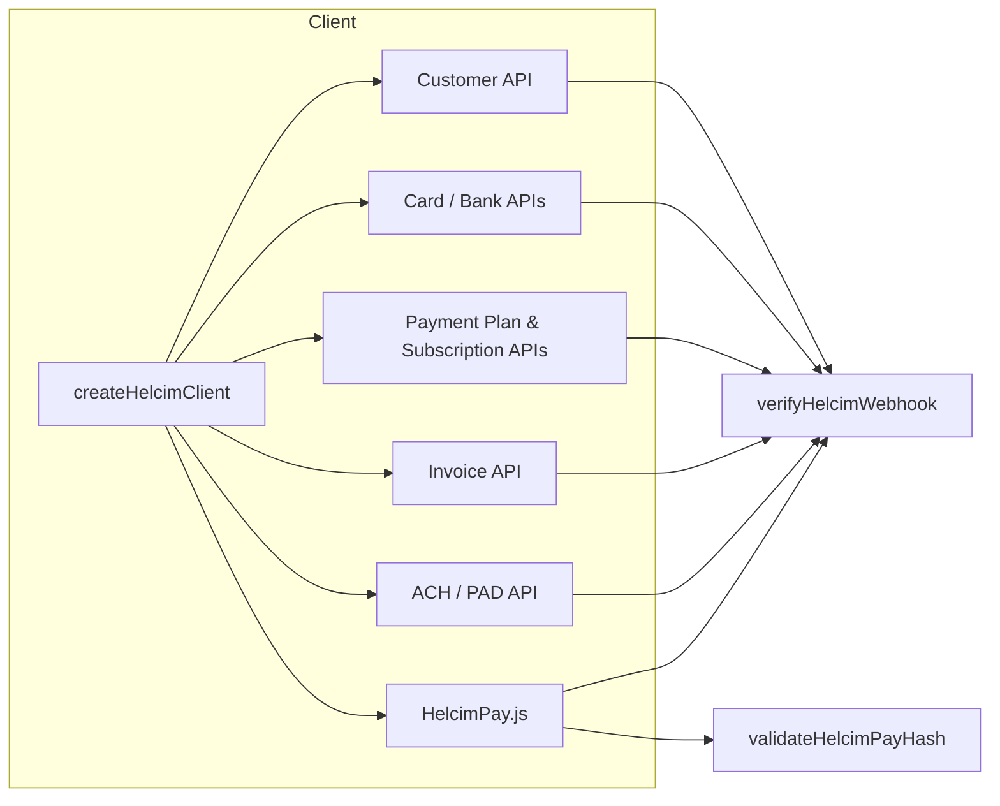

# `helcim-client`

A type-safe, product-neutral Helcim API client for Node.js.

The client wraps the **Helcim Payment API**, **Recurring API** (payment plans & subscriptions), the **Customer/Card vault**, **HelcimPay.js** checkout session initialization, and the two critical verification primitives that every Helcim integration needs: **webhook HMAC-SHA256 verification** and **HelcimPay response-hash validation**.

---

## Why Helcim — especially in Canada

Helcim is a Calgary-based payment processor. For Canadian businesses it offers three advantages over the default choice of Stripe that are hard to ignore: **lower effective cost on every transaction**, **first-class Interac/EFT support**, and **a Canadian-operated stack**.

### Lower effective rates

Stripe's published Canadian online card rate is **2.9 % + CA$0.30** for every successful domestic transaction, and it does not fall automatically as your volume grows. Manually keyed and international transactions are even more expensive, and you may also pay a currency-conversion fee. [Stripe pricing page](https://stripe.com/en-ca/pricing) — [Stripe privacy / Canadian data transfer notice](https://stripe.com/en-ca/privacy).

Helcim uses **interchange-plus** pricing: the actual card-network cost plus a transparent, published margin. Because interchange is the wholesale rate, you are not subsidizing premium cards with a blended flat rate, and Helcim's margin **shrinks automatically as your volume grows**.

| Monthly volume | In-person rate | Keyed & online rate |
|---|---|---|
| $0 – $50K | Interchange + **0.40 % + 8¢** | Interchange + **0.50 % + 25¢** |
| $50K – $100K | Interchange + **0.35 % + 7¢** | Interchange + **0.45 % + 20¢** |
| $100K – $500K | Interchange + **0.25 % + 7¢** | Interchange + **0.35 % + 20¢** |
| $500K – $1M | Interchange + **0.20 % + 6¢** | Interchange + **0.25 % + 15¢** |
| $1M – $5M | Interchange + **0.15 % + 6¢** | Interchange + **0.15 % + 15¢** |

Helcim's typical effective rates land **near or below 2 % in-person and below 2.5 % online**. For a $100 online consumer-card transaction, the processor's margin is only **$0.50 + $0.25**; on Stripe the markup is **$2.90 + $0.30**.

Helcim also publishes its full margin table — there are no back-room negotiations or "contact sales for rates." [Helcim pricing / interchange-plus page](https://www.helcim.com/interchange-plus/).

### ACH / EFT-PAD and Interac Debit

* **ACH / EFT-PAD bank payments:** **0.5 % + $0.25**, capped at **$6** per transaction under $25,000 — far below any card rate. [Helcim ACH page](https://www.helcim.com/ach-payment-processing/)
* **Interac Debit in-person/tap:** **9¢ per transaction** (12¢ for tap) — a flat, predictable cost for card-present Canadian debit.

Stripe supports Canadian ACH through ACSS/PAD, but its standard published rate is **1 % + $0.40**, capped at $5 — roughly double Helcim's rate, and Helcim's PAD agreement flow is built natively into the same customer object this client uses.

### Data sovereignty and operator residency

Helcim is headquartered in **Calgary, Alberta**, and is **PCI Level 1 Service Provider** certified. Its terms of service for Canadian merchants are governed by **Alberta law** and disputes are handled in **Alberta courts**.

By contrast, [Stripe's Canadian privacy policy states](https://stripe.com/en-ca/privacy) that when a Canadian resident's personal data is collected, it is transferred to **data centers in the United States**.

Both processors use SCCs and other transfer safeguards, but the practical difference matters for Canadian businesses: with Helcim your primary payment contracting party, support, fraud/ops tooling, and core settlement rails are domestic. With Stripe, standard data processing defaults to the U.S. before being subject to Canadian privacy frameworks.

| | Helcim | Stripe |
|---|---|---|
| Headquarters | Calgary, Alberta, Canada | San Francisco, California, U.S. |
| Canadian card rate | IC+ margin; effective rate often below 2 % online | 2.9 % + $0.30 (online domestic) |
| Volume discounts | Automatic tiered margin | Custom pricing only by negotiation |
| ACH / EFT-PAD | 0.5 % + $0.25, capped at $6 | 1 % + $0.40, capped at $5 |
| Interac debit | 9¢ (12¢ tap) | Not a native first-class rail |
| Primary data residence | Canada + U.S. (with SCCs) | U.S. |
| Canadian governing law | Alberta | U.S. / varies by product |

> **Sources (retrieved 2026-08-23):** [Helcim pricing](https://www.helcim.com/pricing/), [Helcim interchange-plus](https://www.helcim.com/interchange-plus/), [Helcim ACH fees](https://www.helcim.com/ach-payment-processing/), [Stripe Canada pricing](https://stripe.com/en-ca/pricing), [Stripe Canadian privacy](https://stripe.com/en-ca/privacy), [Helcim privacy / subprocessor list](https://legal.helcim.com/ca/privacy-policy/subprocessors/).

---

## What this library covers



* **Customer vault** — create, list, and update customers and their card/bank-account tokens.
* **Cards & bank accounts** — store, verify, and set default payment methods, with built-in support for Canadian transit/institution and U.S. routing/account number fields.
* **Payment plans & subscriptions** — schedule recurring charges and manage subscription lifecycle.
* **Transactions & refunds** — card transactions and refunds with idempotency-key support.
* **ACH / PAD** — withdraw funds and manage pre-authorized debit agreements.
* **Invoices** — create, list, retrieve, and pay invoices.
* **HelcimPay.js** — initialize a checkout session and validate the response hash so you can trust the returned `cardTransactionId`.
* **Webhook verification** — constant-time HMAC-SHA256 validation of `webhook-signature` headers, including multi-signature parsing.
* **Defensive decoders** — normalize Helcim's inconsistent casing/aliasing (`camelCase`, `PascalCase`, `snake_case`, and provider-specific variants) into a single predictable TypeScript model.

---

## Installation

```bash
npm install @clocklobster/helcim-client
# or
pnpm add @clocklobster/helcim-client
```

---

## Quick start

```typescript
import { createHelcimClient, createHelcimConfigFromEnv } from '@clocklobster/helcim-client';
import { fetch } from 'undici'; // or global fetch if Node >= 18

// Configuration is read from the consuming application's environment.
// Required: HELCIM_API_TOKEN. Optional: HELCIM_ENV / HELCIM_BASE_URL / HELCIM_WEBHOOK_VERIFIER_TOKEN.
const config = createHelcimConfigFromEnv();
if (!config) throw new Error('Helcim is not configured — set HELCIM_API_TOKEN');

const helcim = createHelcimClient(config, fetch);

// Create a customer
const customer = await helcim.createCustomer({
  customerCode: 'example-001',
  contactName: 'Example Customer',
  billingAddress: {
    name: 'Example Customer',
    street1: '123 Example St',
    city: 'Example City',
    province: 'AB',
    country: 'CA',
    postalCode: 'A1A 1A1',
  },
});
```

### Verify a webhook

```typescript
import { verifyHelcimWebhook } from '@clocklobster/helcim-client';

const ok = verifyHelcimWebhook(
  webhookId,         // from `webhook-id` header
  webhookTimestamp,  // from `webhook-timestamp` header
  rawBody,           // the raw request body, before JSON.parse
  signatureHeader,   // from `webhook-signature` header
  verifierToken,     // base64 secret from Helcim dashboard
);

if (!ok) return new Response('unauthorized', { status: 401 });
```

### Validate a HelcimPay response

```typescript
import { validateHelcimPayHash } from '@clocklobster/helcim-client';

const valid = validateHelcimPayHash(
  responseData,  // the parsed JSON object HelcimPay posted back
  responseHash,  // the `hash` field from the response
  secretToken,   // the secret token from HelcimPay configuration
);
```

---

## Quality and test discipline

This package is built with a **property-based + mutation-validated** QA pipeline.

| Suite | Command | Notes |
|---|---|---|
| Unit & contract tests | `npm test` | Vitest + `@fast-check/vitest` property tests |
| Compliance contracts | `npm run test:compliance` | Idempotency, field presence, and endpoint-shape invariants |
| Mutation testing | `npm run test:mutation` | Stryker + Vitest; current **covered score 100.00 %** |

Latest Stryker run:

| File | Total mutants | Killed | Ignored | Covered score |
|---|---|---|---|---|
| `src/client.ts` | 1,465 | 1,465 | 0 | 100.00 % |
| `src/config.ts` | 34 | 32 | 2 | 100.00 % |
| `src/helcimpay.ts` | 54 | 54 | 0 | 100.00 % |
| `src/util.ts` | 87 | 87 | 0 | 100.00 % |
| `src/webhook.ts` | 95 | 95 | 0 | 100.00 % |
| **Total** | **1,735** | **1,733** | **2** | **100.00 %** |

The two ignored mutants in `src/config.ts` depend on environment variables at instrument time and cannot be executed hermetically; they are neither survivors nor no-coverage. All security-critical paths (credential handling, webhook HMAC, HelcimPay hash, and idempotency) are fully triaged with zero untriaged survivors.

See [`docs/QUALITY.md`](./docs/QUALITY.md) for the full QA runbook and [`docs/PRICING.md`](./docs/PRICING.md) for the cost comparison.

---

## Documentation

* [`docs/PRICING.md`](./docs/PRICING.md) — Helcim vs Stripe cost comparison with scenario tables.
* [`docs/QUALITY.md`](./docs/QUALITY.md) — QA pipeline, mutation testing, and how to re-run mutation proofs.
* [`docs/ARCHITECTURE.md`](./docs/ARCHITECTURE.md) — module map, request/response flow, and mermaid diagrams.
* [`docs/COMPLIANCE.md`](./docs/COMPLIANCE.md) — PCI, PIPEDA, GDPR, and SOC 2 readiness boundaries.
* [`docs/mutation-evidence.md`](./docs/mutation-evidence.md) — latest mutation report snapshot.

---

## License

MIT — see [LICENSE](./LICENSE).

Built by [Clock Lobster](https://clocklobster.com).
