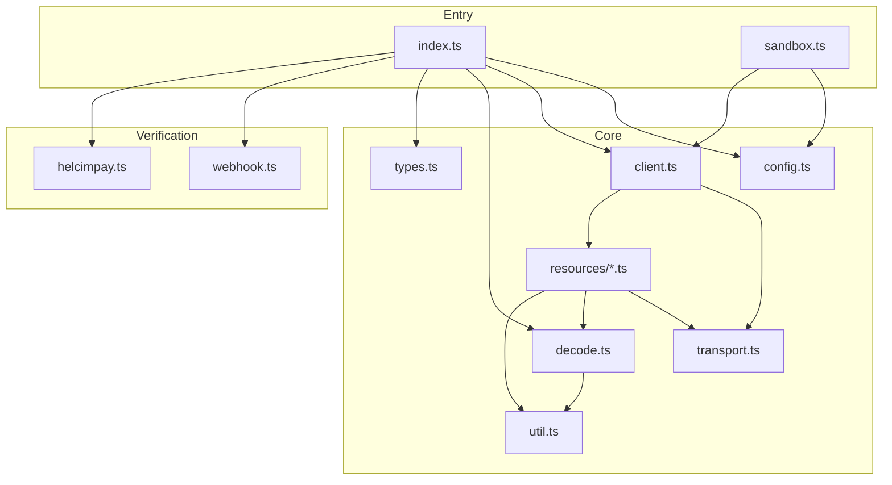
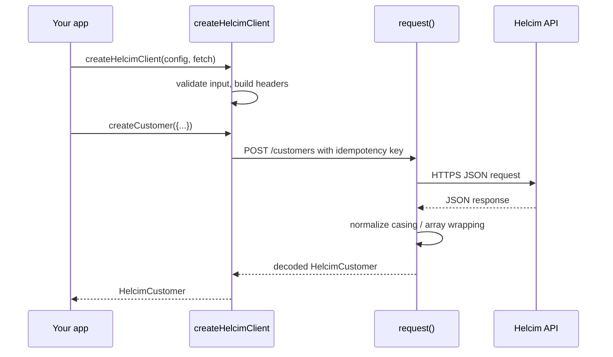
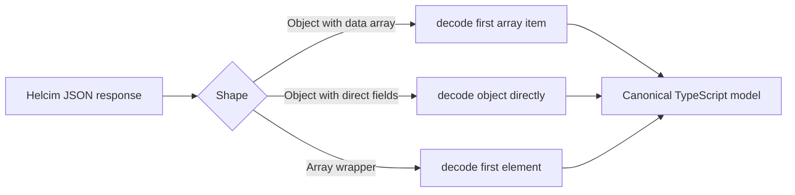
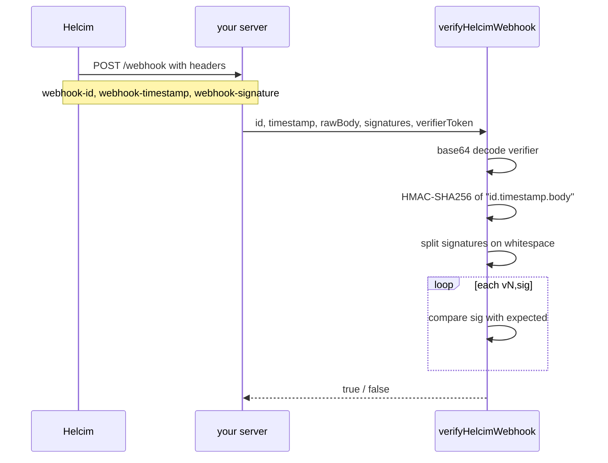
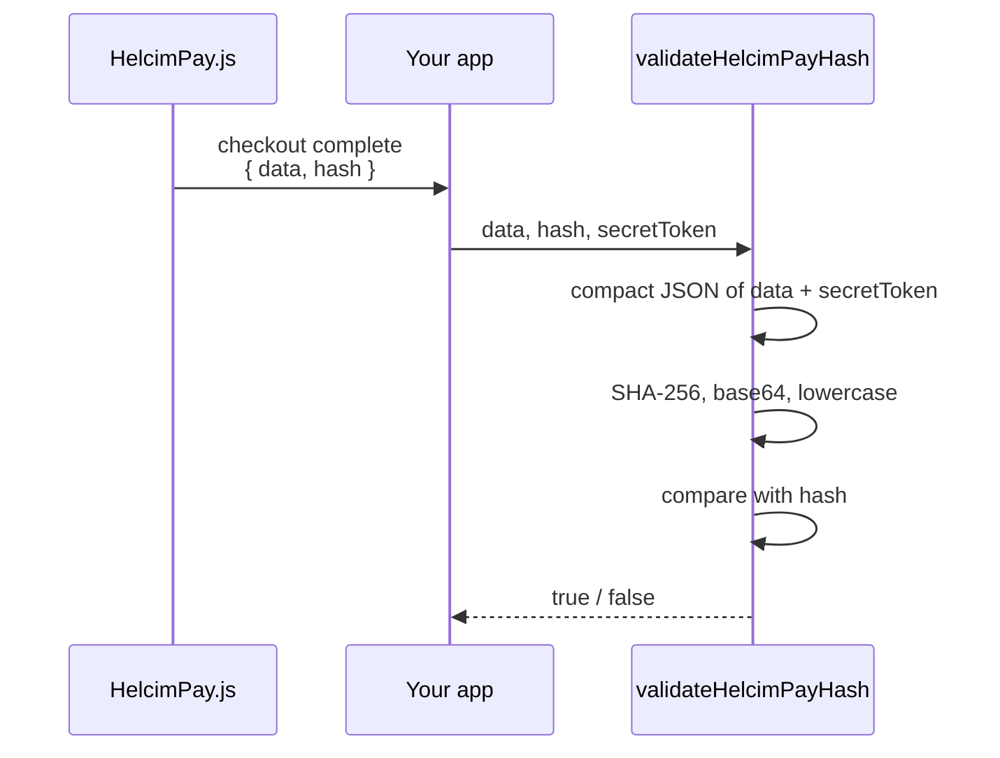
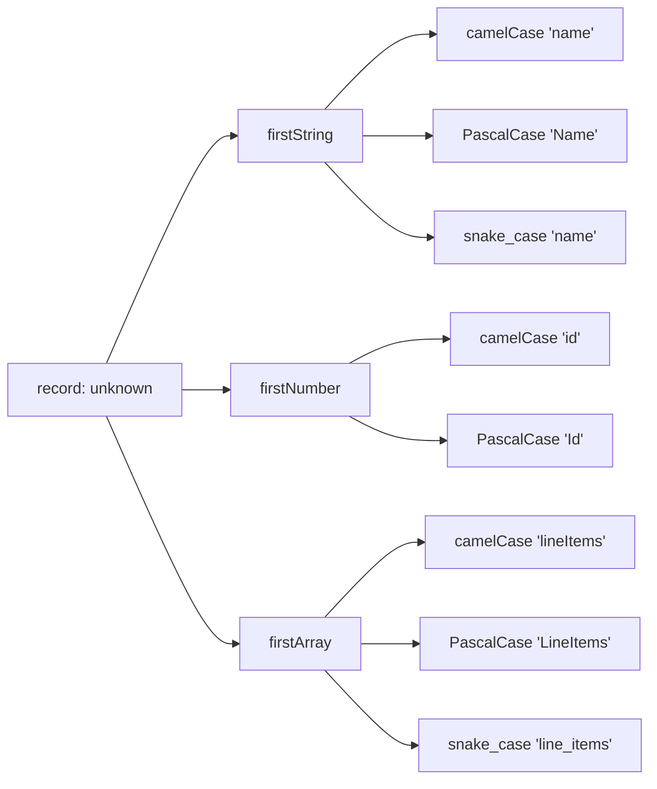
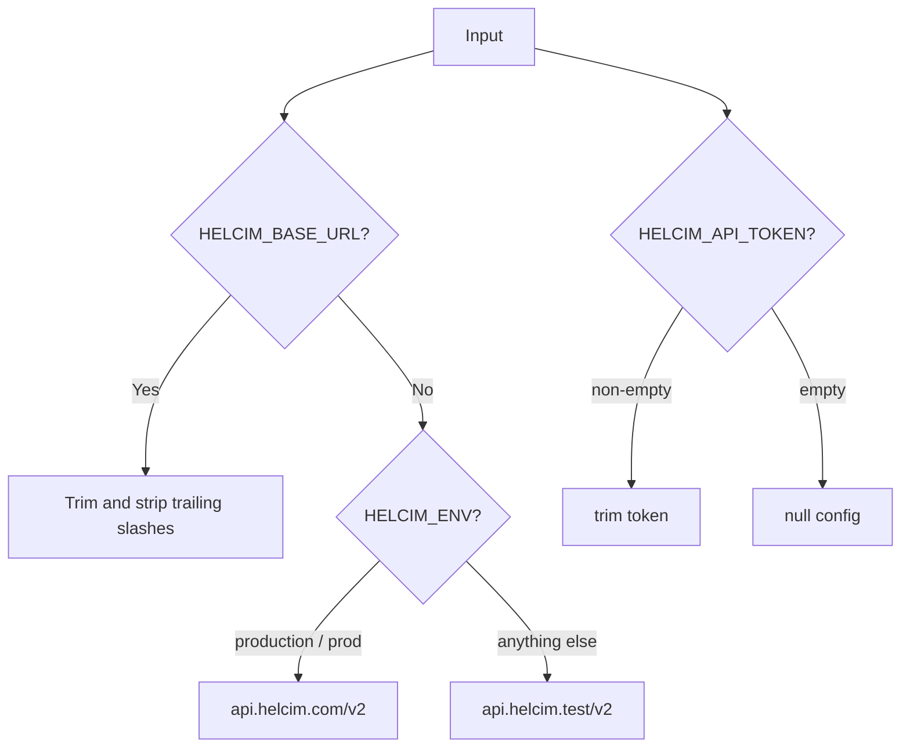

# Architecture

`helcim-client` is an ESM TypeScript package that wraps the Helcim REST API. It is organized into small, single-responsibility modules.

---

## Module map

| File | Responsibility |
|---|---|
| `src/index.ts` | Public exports for the main package. |
| `src/sandbox.ts` | Convenience factory for test-mode clients. |
| `src/config.ts` | Parse environment / explicit config; resolve base URL and API token. |
| `src/client.ts` | Composition root: wires the transport and resource factories into the public client and re-exports shared types/decoders. |
| `src/transport.ts` | Single HTTP entry point: headers, per-request timeout, bounded retry policy, and the `Idempotency-Key` header. |
| `src/resources/*.ts` | Endpoint groups (customers, cards, bank/ACH, plans, subscriptions, invoices, transactions, refunds, HelcimPay), each a factory over `{ request }`. |
| `src/decode.ts` | Response decoders plus validation/unwrapping helpers. |
| `src/types.ts` | Shared entity and input types. |
| `src/util.ts` | Provider-shape helpers (`firstString`, `firstNumber`, `firstArray`), `sha256`, `isProviderErrorStatus`, and idempotency-key generation. |
| `src/webhook.ts` | `verifyHelcimWebhook` — HMAC-SHA256 signature verification with constant-time comparison. |
| `src/helcimpay.ts` | `validateHelcimPayHash` and `parseHelcimPayEventMessage` for HelcimPay.js checkout responses. |

---

## Request lifecycle

Write calls that support replay protection include an **idempotency key** (`Idempotency-Key`). The default key is random per call, so pass an explicit `idempotencyKey` when a retry must be replay-safe.

---

## Response normalization

Helcim returns inconsistent object shapes and key casing across endpoints. The client handles three common patterns:

For example, some invoice endpoints return `{ data: [invoice] }`, others return the invoice object. The client uses `firstArray(raw, ['data'])` and falls back to the raw object so callers always receive a normalized `HelcimInvoice`.

---

## Webhook verification

The comparison is **constant-time** via `crypto.timingSafeEqual` to prevent timing attacks. Multiple signatures are supported; any match is accepted.

---

## HelcimPay verification

The hash is computed on the **compact, escaped JSON** of `data` plus the `secretToken`, exactly matching Helcim's PHP `json_encode` behavior for special Unicode characters. The comparison is case-insensitive and trims surrounding whitespace.

---

## Decoder design

Decoders are defensive. They accept `unknown` input and return a typed object or `null`. The `first*` helpers search multiple key variants:

This lets the client absorb Helcim's inconsistent casing without requiring upstream callers to transform payloads.

---

## Configuration

`createHelcimConfigFromEnv` (from `src/config.ts` and re-exported by `src/index.ts`) resolves the base URL and API token from environment variables or explicit values:

The default is the **test endpoint**, so a missing `HELCIM_ENV` cannot accidentally send requests to production.

---

## Idempotency

Mutating write calls that support replay protection generate a random idempotency key using `crypto.randomUUID` and send it as the `Idempotency-Key` header. Callers can pass their own key for cross-request replay safety.
