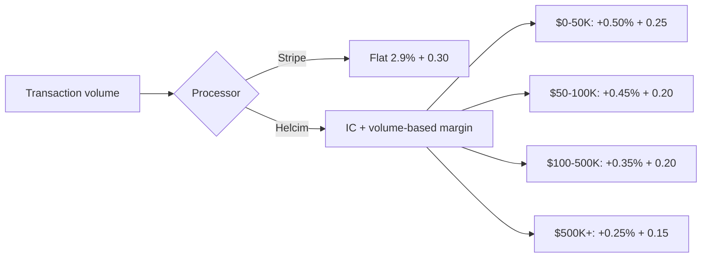

# Helcim vs Stripe pricing comparison

This document compares the **published Canadian pricing** of Helcim and Stripe as of 2026-08-23. All rates are taken directly from each provider's public pricing or legal pages.

---

## Sources

- [Helcim pricing page](https://www.helcim.com/pricing/)
- [Helcim interchange-plus page](https://www.helcim.com/interchange-plus/)
- [Helcim ACH payment processing](https://www.helcim.com/ach-payment-processing/)
- [Stripe Canada pricing](https://stripe.com/en-ca/pricing)
- [Stripe Canadian privacy policy](https://stripe.com/en-ca/privacy)
- [Helcim Canada privacy / sub-processors](https://legal.helcim.com/ca/privacy-policy/subprocessors/)

> **Note:** Interchange (IC) is the wholesale cost set by the card networks and is the same no matter which processor you use. It varies by card type, country, and transaction environment, and is typically **1.4 % – 1.8 %** for Canadian consumer credit cards.

---

## Card-not-present / online card payments

This is the most common comparison for SaaS, e-commerce, and invoice businesses.

| Provider   | Model            | Rate on a $100 domestic consumer-card transaction | Rate on a $100 premium/reward card transaction |
| ---------- | ---------------- | ------------------------------------------------- | ---------------------------------------------- |
| **Stripe** | Flat rate        | **2.9 % + $0.30** = $3.20                         | **2.9 % + $0.30** = $3.20 (same)               |
| **Helcim** | Interchange-plus | ~IC 1.5 % + 0.50 % + $0.25 = ~$2.25               | ~IC 1.8 % + 0.50 % + $0.25 = ~$2.55            |

At a typical Canadian consumer credit-card interchange of **1.5 %**, Helcim's $100 online transaction costs **~$2.25** versus Stripe's **$3.20** — a **30 % reduction** in processing cost. For a business doing **$50,000/month** in online card volume, that difference is roughly **$475/month** or **$5,700/year**.

### Volume discount comparison

| Monthly online volume | Stripe domestic rate   | Helcim margin       |
| --------------------- | ---------------------- | ------------------- |
| $0 – $50K             | 2.9 % + $0.30          | IC + 0.50 % + $0.25 |
| $50K – $100K          | 2.9 % + $0.30          | IC + 0.45 % + $0.20 |
| $100K – $500K         | 2.9 % + $0.30          | IC + 0.35 % + $0.20 |
| $500K+                | Custom / contact sales | IC + 0.25 % + $0.15 |

Stripe only lowers its rate through custom **enterprise negotiations**. Helcim applies tiered margins **automatically** based on trailing 3-month volume.

---

## In-person / card-present card payments

| Provider             | Rate                              |
| -------------------- | --------------------------------- |
| **Stripe Terminal**  | 2.7 % + $0.05                     |
| **Helcim in-person** | IC + 0.40 % + 8¢ ($0–$50K volume) |

With a typical Canadian debit or basic credit card, Helcim's effective rate is **near or below 2 %**, while Stripe is **2.7 % + $0.05** regardless of card type.

---

## Bank payments — ACH / EFT-PAD

| Provider                 | Rate              | Cap                                  | Notes                                                            |
| ------------------------ | ----------------- | ------------------------------------ | ---------------------------------------------------------------- |
| **Helcim ACH / EFT-PAD** | **0.5 % + $0.25** | **$6** per transaction under $25,000 | Native PAD agreement support; returns cost $5                    |
| **Stripe ACSS / PAD**    | **1 % + $0.40**   | **$5** per transaction               | Standard published rate; no native Canadian PAD agreement object |

For a **$500 bank payment**, Helcim costs **$2.75** ($0.5% = $2.50 + $0.25) while Stripe costs **$5.40** ($1% = $5.00 + $0.40). For larger B2B invoices or rent payments, Helcim's lower percentage can save thousands per month.

---

## Interac Debit

| Provider                 | Cost                                                  |
| ------------------------ | ----------------------------------------------------- |
| **Helcim Interac Debit** | **9¢ per transaction** (12¢ for tap)                  |
| **Stripe**               | No native Interac Debit rail at these published rates |

Interac Debit is unique to Canada and is the cheapest card-present payment method for high-volume, low-ticket merchants. A $10 Interac sale with Helcim costs 9¢, while the same sale with a card on Stripe costs **$0.32** (2.7 % + $0.05, plus interchange) — more than **3× the cost**.

---

## Scenario tables

### Scenario A: SaaS monthly subscription — $100 × 500 customers

| Provider   | Calculation                                          | Total monthly fees | Fee rate |
| ---------- | ---------------------------------------------------- | ------------------ | -------- |
| **Stripe** | 2.9 % × $50,000 + $0.30 × 500                        | **$1,600.00**      | 3.20 %   |
| **Helcim** | ~1.5 % IC × $50,000 + 0.50 % × $50,000 + $0.25 × 500 | **$1,125.00**      | 2.25 %   |

**Monthly savings with Helcim: $475.00**  
**Annual savings: $5,700.00**

### Scenario B: B2B invoice paid by bank transfer — $2,500 × 40 invoices

| Provider            | Calculation                   | Total monthly fees | Fee rate |
| ------------------- | ----------------------------- | ------------------ | -------- |
| **Stripe ACSS/PAD** | 1 % × $100,000 + $0.40 × 40   | **$1,016.00**      | 1.016 %  |
| **Helcim ACH/PAD**  | 0.5 % × $100,000 + $0.25 × 40 | **$510.00**        | 0.51 %   |

**Monthly savings with Helcim: $506.00**  
**Annual savings: $6,072.00**

### Scenario C: Retail coffee shop — $8 × 2,000 Interac Debit taps per month

| Provider                  | Calculation                     | Total monthly fees | Fee rate |
| ------------------------- | ------------------------------- | ------------------ | -------- |
| **Stripe in-person card** | 2.7 % × $16,000 + $0.05 × 2,000 | **$532.00**        | 3.325 %  |
| **Helcim Interac tap**    | $0.12 × 2,000                   | **$240.00**        | 1.50 %   |

**Monthly savings with Helcim: $292.00**  
**Annual savings: $3,504.00**

---

## Hidden fee check

| Fee type           | Helcim    | Stripe                 |
| ------------------ | --------- | ---------------------- |
| Monthly fee        | $0        | $0                     |
| Setup fee          | $0        | $0                     |
| Cancellation fee   | $0        | $0                     |
| PCI compliance fee | $0        | $0 (for basic Stripe)  |
| Volume discount    | Automatic | Custom/negotiated only |

Both processors are transparent about core fees, but Stripe's standard rate does not improve until you negotiate an enterprise package. Helcim's rate improves mechanically as you grow.

---

## Why this matters for SaaS and Canadian platforms

1. **Higher margins on subscriptions and invoices** — SaaS businesses live on thin recurring margins. A 0.8 % – 1 % reduction in payment cost flows almost directly to net income.
2. **No negotiation tax** — Founders do not need to spend cycles negotiating with a sales team to get fair rates.
3. **Native Canadian rails** — Interac Debit and EFT-PAD are first-class in Helcim's API, not bolted-on alternative payment methods.
4. **Predictable cost scaling** — The margin table is public, so you can forecast payment costs as you grow.
