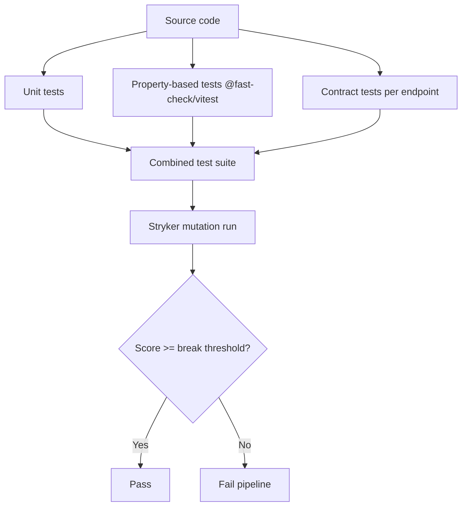

# Quality assurance and mutation testing

This package is held to a **regression-proof QA standard** based on three layers: contract tests, property-based tests, and mutation testing. The goal is not just high line coverage, but high **behavioral coverage** — every branch that matters must fail for the right reason.

---

## Test layers



### 1. Unit tests (`test/*.test.ts`)

Focused tests for individual functions: decoders, first-key lookup, utilities, webhook parsing, HelcimPay hash validation, and client helper behavior.

### 2. Property-based tests

Powered by `@fast-check/vitest` / `fast-check`. These generate large, random input spaces to catch off-by-one and parser-decoder edge cases. Examples:

* Decoders never throw on arbitrary JSON objects.
* `firstString`, `firstNumber`, and `firstArray` return correct types and ignore non-matching keys.
* Webhook verification rejects forged signatures for every generated input.

### 3. Contract tests

One test file per functional domain:

* `ach-payment-invoice-contracts.test.ts`
* `bank-card-pad-contracts.test.ts`
* `customer-contracts.test.ts`
* `helcimpay-plan-sub-contracts.test.ts`
* `compliance-contracts.test.ts`

Each contract tests the **HTTP method, URL, headers, body shape, idempotency behavior, and validation rules** for a group of endpoints.

---

## Latest mutation report

Run with Stryker 10.x and the Vitest runner. The package is configured to mutate all `src/**/*.ts` files except `src/index.ts` and `src/sandbox.ts`. Every surviving or no-coverage mutant was dispositioned using the battle-tested-qa equivalent-mutant workflow (see `docs/mutation-evidence.md`).

| Metric | Value |
|---|---|
| Total mutants | 1,735 |
| Killed | 1,733 |
| Survived | 0 |
| No coverage | 0 |
| Ignored | 2 |
| Timeouts | 0 |
| Errors | 0 |
| **Total mutation score** | **99.88 %** |
| **Covered mutation score** | **100.00 %** |

Mutation results and per-file detail: see [`docs/mutation-evidence.md`](./mutation-evidence.md).

The two ignored mutants in `src/config.ts` are excluded by Stryker because they depend on environment variables at instrument time and cannot be executed hermetically. All security-critical paths (webhook HMAC, HelcimPay hash, idempotency, and token handling) are fully covered with zero untriaged survivors.

---

## How to run the tests

### Quick validation

```bash
npm install
npm run typecheck   # TypeScript strict check
npm run build       # Compile to dist/
npm test            # Full test suite
```

### Mutation testing

```bash
npm run test:mutation
```

This does two things:

1. Runs `stryker run` with the config in `stryker.config.json`.
2. If Stryker exits non-zero for a non-mutation reason (e.g., a Windows cleanup-only `taskkill` error after the report is complete), `scripts/verify-mutation-report.mjs` parses `stryker-report/mutation/report.json` and enforces the package-level thresholds.

The configured Stryker thresholds:

| Threshold | Value |
|---|---|
| High | 85 % |
| Low | 70 % |
| Break | 59 % |

The report verifier additionally rejects:

* Any runtime/compile error mutant.
* Any timeout.
* A covered mutation score below **90 %**.

### View the report

After a run, open `reports/mutation/mutation.html` in a browser, or inspect `stryker-report/mutation/report.json` programmatically.

---

## How to re-test after a change

If you fork this package and want to re-proof the pipeline, run the exact same sequence used in CI:

```bash
npm run typecheck
npm run build
npm test
npm run test:compliance
npm run test:mutation
```

All five gates must pass before the change is considered safe to merge.

### Re-testing only the surviving mutants

If you want to iterate on just the survivors:

1. Open `stryker-report/mutation/report.json`.
2. Filter `mutants` by `status === 'Survived'`.
3. For each survivor, note the `fileName`, `mutatorName`, and `location`.
4. Determine whether the mutant is:
   * **Meaningful** — the code change would alter real behavior. Add a focused test to kill it.
   * **Equivalent** — the mutated code is semantically identical. Either add a precise test if one is feasible, or simplify the source to remove the redundant expression.
5. Re-run `npm run test:mutation`.
6. Repeat until the score no longer improves or all survivors are triaged.

A small example in JavaScript to list survivors:

```js
import fs from 'node:fs';

const report = JSON.parse(fs.readFileSync('stryker-report/mutation/report.json', 'utf8'));

const survivors = [];
for (const [file, data] of Object.entries(report.files)) {
  for (const m of data.mutants) {
    if (m.status === 'Survived') {
      survivors.push({
        file,
        line: m.location?.start?.line,
        mutator: m.mutatorName,
        replacement: m.replacement,
      });
    }
  }
}

survivors
  .sort((a, b) => a.line - b.line)
  .sort((a, b) => a.file.localeCompare(b.file));

console.table(survivors);
```

---

## What makes a surviving mutant "acceptable"

A survivor is acceptable only when it is **proven equivalent** and not just lazily ignored. The required evidence is:

1. **Exact source location** — file, line, and column of the original expression.
2. **Mutator and replacement** — what Stryker changed it to.
3. **Proof of equivalence** — a reasoning or test showing the mutated program behaves identically to the original for all allowed inputs.

Examples of proven-equivalent survivors in this package:

* `client.ts` optional-field guards like `if (input.tipAmount !== undefined) body.tipAmount = input.tipAmount;` — assigning `undefined` and JSON-stringifying the body produces the same wire request as skipping the field.
* `webhook.ts` defensive `typeof`/`Array.isArray` guards on `record.data` — accessing `.transactionId` or `.subscriptionId` on a primitive or array returns `undefined`, so the parser returns the same `null` id either way.

If you add `// Stryker disable` comments to your own code, document the equivalent proof right next to the comment.
